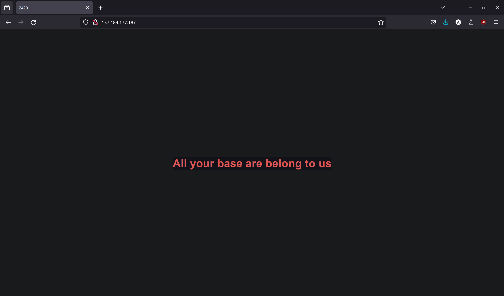

### nginx-2420 as3_p1
This tutorial will cover how to take a reader from a fresh Arch Linux server on DigitalOcean to serve a demo document!

---
### Install the necessary software

First we will need some software before starting!

Let's install vim:
- `sudo pacman -Syu vim`
- we are going to be using this to edit some configuration files!

Next, let's install nginx:
- `sudo pacman -S nginx`
- this is a great web server tool that can help host the demo document we will be going through.

---
### Create a Directory for the website documents

Next, we will create a directory where our html files will be, which is essentially our web pages!

We will store our html files in the path, `/web/html/nginx-2420`:

Go to your home directory, and create a directory like this:
- `sudo mkdir -p /web/html/nginx-2420`
- we will be using this path later, so don't forget about it!

---
### Making a index.html

In the directory, `/web/html/nginx-2420`:
- create a file called `index.html` in the directory
- `sudo touch index.html`

Next, we will be editing the file and pasting in the following document:
```html
<!DOCTYPE html>
<html lang="en">
<head>
    <meta charset="UTF-8">
    <meta name="viewport" content="width=device-width, initial-scale=1.0">
    <title>2420</title>
    <style>
        * {
            color: #db4b4b;
            background: #16161e;
        }
        body {
            display: flex;
            align-items: center;
            justify-content: center;
            height: 100vh;
            margin: 0;
        }
        h1 {
            text-align: center;
            font-family: sans-serif;
        }
    </style>
</head>
<body>
    <h1>All your base are belong to us</h1>
</body>
</html>
```
- This document is a simple web page, which will display *"All your base are belong to us"*, in a redish color and the sentence will be centered in the middle.
- The background will also be a blueish kind of color


Now all we need to do is insert the contents into the index.html!
- while in the `/web/html/nginx-2420` directory, edit the `index.html` file using vim, or another editor of your choice.
- `sudo vim index.html`
- Then insert the provided document into the `index.html`
  - make sure to click `I` to be on insert mode while in vim!
- It should look something like this:
  - to exit, hit `esc` button, then type `:wq` and hit enter to write the contents to the file, and quit afterwards.


---
### Creating directorys, sites-enabled and sites-available

Next, lets create a directory for a config file for your web!

First navigate to where the config files of `nginx` are, which is in `/etc/nginx`
- `cd /etc/nginx`

While in that directory, create another directory which will have the config file for the web we are currently making.
- `sudo mkdir sites-available`
- you can name the file anything you would like, however `sites-available` is one of the standard naming conventions for additional configuration files other than the main `nginx.conf` file.

Then, go into the `sites-available` directory.
- `cd sites-available`
- so your current working directory should be: `/etc/nginx/sites-available`

Then create a config file with any name of your choosing, I will be going with `nginx-2420.conf`.
- `sudo touch nginx-2420.conf`
- make sure to have the `.conf` at the end

Edit the config file:
- `sudo vim nginx-2420.conf`
- In the file write in the following server block,
  - server blocks help in serving multiple doamins, and it listens to the domains and handle the traffic for them.


- So this server block will listen to the port 80
- The `location` block with the `/` specifies the home directory in your web.
- the `root` specifies where its getting the html page for that web page location.
- the `index` is just specifying the `index.html`

Make sure to save your current configuration file

Then finally, make another directory named `sites-enabled` in the path, `/etc/nginx`
- `sudo mkdir sites-enabled`
- This directory are for servers that we want to use

So you should have these two directories before moving on:

---
### Append the sites-enabled to the main nginx config file

Next go back to the path, `/etc/nginx`
- `cd /etc/nginx`

Then edit the main configuration file of `nginx`
- `sudo vim nginx.conf`
- So in the `http` block, scroll all the way down and at the end of the block, write the following:
  - `include /etc/nginx/sites-enabled/*.conf;`
- It should look something like this:


- remember, this is at the end of the `http`!
- this tells nginx to include whatever site is in the specified directory.

Next, make sure to comment out the current server block in the `nginx.conf` file:
- It should look something like this,


Then to enable the site:
- `sudo ln -s /etc/nginx/sites-available/nginx-2420.conf /etc/nginx/sites-enabled/nginx-2420.conf`
- this is a symlink to enable a site!
- to disable an active link, you would just unlink:
  - `sudo unlink /etc/nginx/sites-enabled/nginx-2420.conf`

---
### Go to your web page

So first start the `nginx` service:
- `sudo systemctl start nginx`

If you want the service to start at boot:
- `sudo systemctl enable nginx`

Next go to a web browser, and type in the ip address of your droplet:
- in my case, it is `137.184.177.187`
- just type that in the search bar:


Then the webpage should look like this!


There you go! You have now made a web server!

---