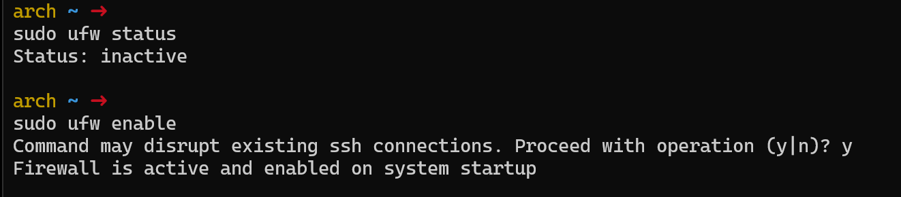

### Using UFW and a Reverse Proxy Server to the Backend
- this tutorial will build off from the previous tutorial where we made a webserver!

> Since you used a Digitalocean droplet, use the server ip and not your localhost to connect to your webserver.
> ex: 137.187.177.187 < this is my digital ocean droplet server ip

Make sure to check if `nginx` is running by `systemctl status nginx`.
- if it is not running: `sudo systemctl start nginx`

---

### Install UFW
To install: `sudo pacman -S ufw`

Then enable and start the service using `systemctl`:
`sudo systemctl enable --now ufw.service`

---
### Setting up a firewall


Run `sudo ufw status`
- If it says along the lines of: `ERROR: problem running iptables: iptables v1.8.10 (nf_tables): Could not fetch rule set generation id: Invalid argument`
- Go ahead and reboot the droplet by: `sudo reboot`
- Then wait for a few minutes before trying to get back onto the droplet

When first running `sudo ufw status` you should get `inactive`. 

First lets allow some ports in using `ufw` before enabling the firewall.
- allow the http port: `sudo ufw allow http` or `sudo ufw allow 80`, they are the same thing.
- allow the ssh port: `sudo ufw allow ssh` or `sudo ufw allow 22`, they are the same thing. (This is to allow ssh connections so you can still get back onto the droplet after enabling)
- allow the port `8080`: `sudo ufw allow 8080`
- You can also do `sudo ufw allow https`, for ipv6. (This one is optional)

Make sure you have all the configurations, you can check by: `sudo ufw status verbose` to see your firewalls.

After checking, you can now enable `ufw`

To enable `ufw`: `sudo ufw enable`


---
### The Backend Binary File
Next download the following file with this link: https://gitlab.com/cit2420/2420_notes_w24/-/blob/main/attachments/hello-server?ref_type=heads

Then we will use `sftp` to make a copy of the binary file into our arch digital droplet.

Open up a Windows terminal and remember where you downloaded the binary file.

Just like how we ssh into our arch droplet, instead of `ssh <droplet>`, you would do `sftp <droplet>`.

Then to put a copy of the binary file from your machine into your arch droplet: `put <binary-file-location> <destination-file>`
- for example: `put Downloads/hello-server /usr/local/bin`
- I am taking the `hello-server` file from my local machine's `Downloads` folder, and copying that over to the arch droplet's location I specified, `/usr/local/bin`

We will be putting the binary file into the `/usr/local/bin` as this is where binary files go.

Then make the `hello-server` binary file as a executable because the binary gets executed.
- `sudo chmod +x /usr/local/bin/hello-server`

---

### Service Files
Make a service in the `/etc/systemd/system` as this is where service files are generally stored.
- you can name it whatever you want, I will name mine `hello-server.service`
- I created a file by: `sudo touch /etc/systemd/system/hello-server.service`

Open the service file: `sudo vim /etc/systemd/system/hello-server.service`
Paste in the following in the service file:
```ini
[Unit]
Description=hello-server backend

[Service]
ExecStart=/usr/local/bin/hello-server

[Install]
WantedBy=multi-user.target
```
- The `Description` is just a description of the service file
- `ExecStart` is to specify where the executable is to start the service
- `WantedBy=multi-user.target` is so that the service can be used by multiple users.

Afterwards make sure you start and enable the service on boot, so you don't have to keep starting the service.
- To start: `sudo systemctl start hello-service`
- Then make it start on boot by: `sudo systemctl enable hello-service`

Then go into the nginx config directory to add some locations into your server block: 
- `cd /etc/nginx/sites-available`, remember we made this directory along with `sites-enabled` from the last tutorial

Using vim or an editor of your choice edit the config file in the `sites-available` directory.
- `sudo vim nginx-2420.conf`
- `sudo nano nginx-2420.conf`
- etc.

Then edit your `nginx-2420.conf`, and add the following:
```init
server {
    listen 80;
    listen [::]:80;
    server_name _;
    root /web/html/nginx-2420;

    location / {
        index index.html
    }

    location /hey {
        proxy_pass http://127.0.0.1:8080/hey;
    }

    location /echo {
        proxy_pass http://127.0.0.1:8080/echo;
    }
}
```
The `proxy_pass` is used to send a request to the proxied server, in our case the `http://127.0.0.1:8080/hey` and `http://127.0.0.1:8080/echo`. Then a fetch is made for the response and sends it back to the client!

---
### Final set-ups
You are almost finished!

Before doing any testing, lets reload the systemctl daemon so that it restarts all the services.
- `sudo systemctl daemon-reload`

Then for safe measure I like to reboot my droplet by:
- `sudo reboot`
- then wait a few minutes and enter again

After the reboot, I check if the following services are running to make sure we can access them.
- `systemctl status nginx`
- `systemctl status hello-server`

---
### Testing
I am going to be using Postman to do the testing.

First lets make sure our home page is still working:


Test out the /hey:
Open up Postman and open up a new tab. Then make sure it is a `GET` request, and have your arch droplet ip address in the send bar `<droplet-ip>/hey`: `http://137.184.177.187/hey` in my case.

This should be the output for `/hey`. 

Let's test out the /echo:
Now do the same thing, but this time a `POST` request, with `<droplet-ip>/echo`: `http://137.184.177.187/echo` in my case.

However, before you send, go to the `Headers` like the screenshot below, and add the `Content-Type` key with the value `application/json`. You can easily add them by just typing on the greyed out letters of `key` and `value`.


Then select the `Body`, then `raw` and make sure its `JSON` format.
Then just type out the follwing:
```JSON
{
    "message": "Hello from your server"
}
```

Then hit the send button!

The output should be as follows:


---
